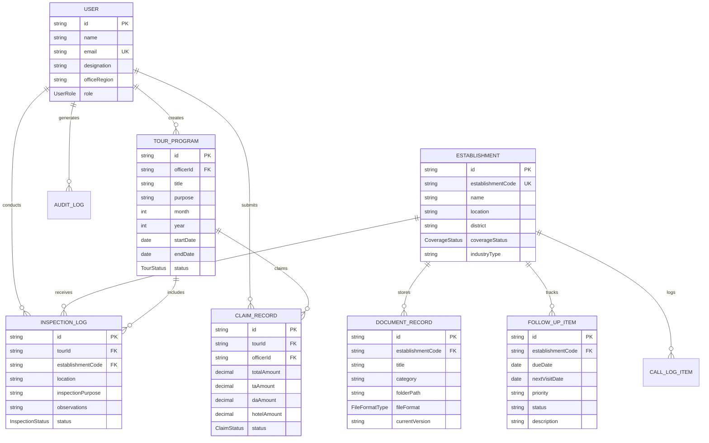

# EPFO EO Tour Diary - Database Entity-Relationship Diagram (ERD)

## Overview
The **EPFO EO Tour Diary** database is designed according to **Third Normal Form (3NF)** specifications in PostgreSQL using Prisma ORM.

---

## Visual Mermaid ER Diagram

---

## Schema Table Summary

| Table Name | Primary Key | Foreign Keys | 3NF Purpose |
| :--- | :--- | :--- | :--- |
| `users` | `id` | - | Officers & Regional Administrative Users |
| `establishments` | `id` | `establishmentCode` (Unique) | Master registry of covered & exempted establishments |
| `tour_programs` | `id` | `officerId` -> `users.id` | Monthly tour itineraries and approvals |
| `inspection_logs` | `id` | `tourId` -> `tour_programs.id`, `establishmentCode` -> `establishments.establishmentCode` | Field inspection log entries |
| `document_records` | `id` | `establishmentCode` -> `establishments.establishmentCode` | Digital document repository & versions |
| `follow_up_items` | `id` | `establishmentCode` -> `establishments.establishmentCode` | Pending compliance action items & reminders |
| `claim_records` | `id` | `tourId` -> `tour_programs.id`, `officerId` -> `users.id` | TA/DA travel reimbursement bills |
| `call_log_items` | `id` | `establishmentCode` -> `establishments.establishmentCode` | Employer liaison phone & WhatsApp logs |
| `audit_logs` | `id` | - | Immutable security audit trail |
